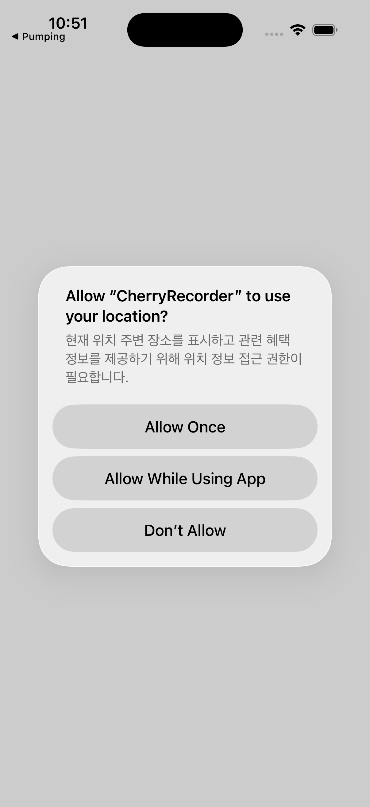

# CherryRecorder Client

CherryRecorder의 Flutter 클라이언트 복원본입니다. 장소 탐색, 지도, 장소 상세, 메모, 태그별 기록, 채팅 등 기존 제품 흐름을 유지하면서 2026년 현재 Flutter/Xcode 환경에서 다시 빌드·실행할 수 있도록 호환성 문제만 정리했습니다.

> 이 저장소는 과거 팀 프로젝트 코드베이스를 보존·복원한 것입니다. README의 과거 팀원 목록, 개인 연락처, 더 이상 유효하지 않은 배포 링크는 제거했으며 제품 UI와 핵심 기능은 가능한 한 원형을 유지했습니다.

## Restored preview

| Splash | Map entry |
| --- | --- |
|  |  |

위 이미지는 Flutter 3.47.1로 iOS Simulator용 앱을 실제 빌드·설치·실행한 뒤 캡처한 화면입니다.

## 주요 기능

- 현재 위치 기반 지도 탐색
- 주변 장소 검색 및 텍스트 검색
- 장소 상세 정보와 사진 조회
- 장소별 메모 작성 및 조회
- 태그 기반 메모 탐색
- HTTP API + WebSocket 기반 서버 통신
- 로컬 저장소를 활용한 클라이언트 상태 유지

## Stack

- Flutter 3.47.1 / Dart 3.13.1
- Google Maps Flutter
- Provider / Riverpod / Bloc
- HTTP / WebSocket
- SQLite / local persistence

## 현재 환경에서 실행

```bash
flutter pub get
flutter analyze
flutter test
flutter run
```

검증 결과:

- `flutter analyze` — no issues
- `flutter test` — 30 tests passed
- `flutter build ios --simulator --debug --no-codesign` — success

Google Maps와 Places 기능은 플랫폼별 API key 설정이 필요합니다. 키나 자격 증명은 저장소에 포함하지 않습니다.

## 서버 연동

기본 서버 구성은 별도 C++ 백엔드 저장소와 함께 동작합니다.

- HTTP: health/status, Maps key, Places nearby/search/details/photo
- WebSocket: 실시간 채팅/메시징 기반

Android Emulator에서 로컬 서버를 사용할 경우 `localhost` 대신 `10.0.2.2`가 필요할 수 있습니다.

## 복원 범위

이번 정리에서는 새 제품 기능을 추가하지 않았습니다. 원래 화면과 정보구조를 유지하면서 최신 Flutter/Xcode에서 실행을 막던 SDK·패키지·iOS project migration만 반영했습니다.
